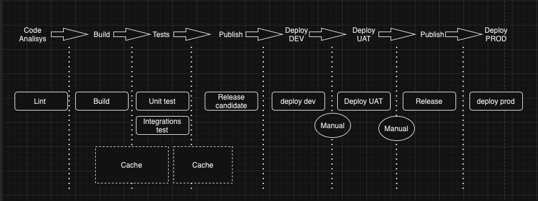

##ReadmeFile###
**P2P Schedules API Facade**

Facade which aggregates the P2P Schedules APIs of the following Carriers:

ANNU, ANRM, APLU, CHNL, CMDU, COSU, HDMU, MAEI, MAEU, MSCU, ONEY, OOLU,ZIMU,HLCU

Other Carriers currently do not offer such an API.

The Facade provides a consistent interface for requests and responses. A Swagger doc decribing this interface is provided, on localhost see: localhost:8000/docs#/API Point To Point Schedules/get_schedules_schedules_p2p_get

Tested under Python 3.11 (see Dockerfile).

For a list of dependencies refer to requirements.txt.

Results are cached in a remote MongoDB based on carrierp2p setting

**TODO:** Currently the .env file contains several secrets, these should be removed from there. Locally the need to be stored in a gitignored file, in OCP they can be provided via Secret.

**TODO:** In mongo_mgr.py there are commented out MongoDB index creations. In theory, they could be left in the code, as the index is not recreated if it already exists. But if the index options change (e.g. the expiry time), recreating the index throws an exception. There this index handling should be taken care of separately.

**TODO:** If we use redis_mgr.py,please setup redis, put the credential into env file ,uncomment the redis credential in config.py and change cacheDB to RedisDB in configmap.yaml

# CICD Workflow
This section describes the CICD workflow.

## Stages and jobs

1. **Code Analysis**: In this stage, we will check code with lint, sonar, etc
2. **Build**: The build stage will be responsible for packaging the applications or creating a docker image to be pushed to the images repository. In this stage, a should be created a cache to change files generated by the build.
3. **Tests**: Tests are important in every project. This stage should aggregate the Unit test and the Integrations test. 
5. **Publish**: A release candidate is created to be deployed in DEV and UAT environments.
6. **Deploy DEV**: Deploy the release candidate in the DEV environment
7. **Deploy UAT**: Deploy the release candidate in the UAT environment
8. **Publish**: Promote the release candidate to a final release
9. **Deploy PROD**: Deploy the release in a Production environment.

# Environments:
## [DEV](http://internal-p2papicarriers-alb-670514342.eu-central-1.elb.amazonaws.com/)
## [UAT](http://internal-p2papicarriers-alb-1729903004.eu-central-1.elb.amazonaws.com/)
## [PROD]()

# Aux ECS
## Force Redeploy
´´´
aws ecs update-service --cluster p2p_schedule_api_of_carriers_cluster --service p2p_schedule_api_of_carriers_service --force-new-deployment
´´´

demo01
